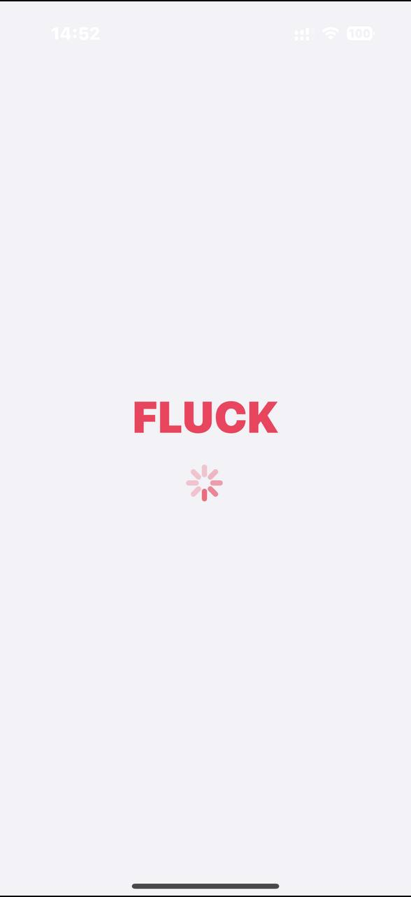
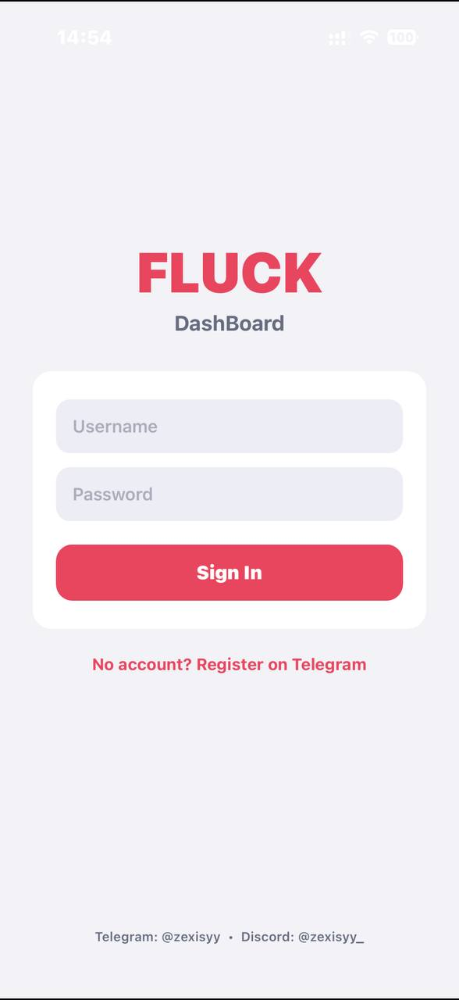
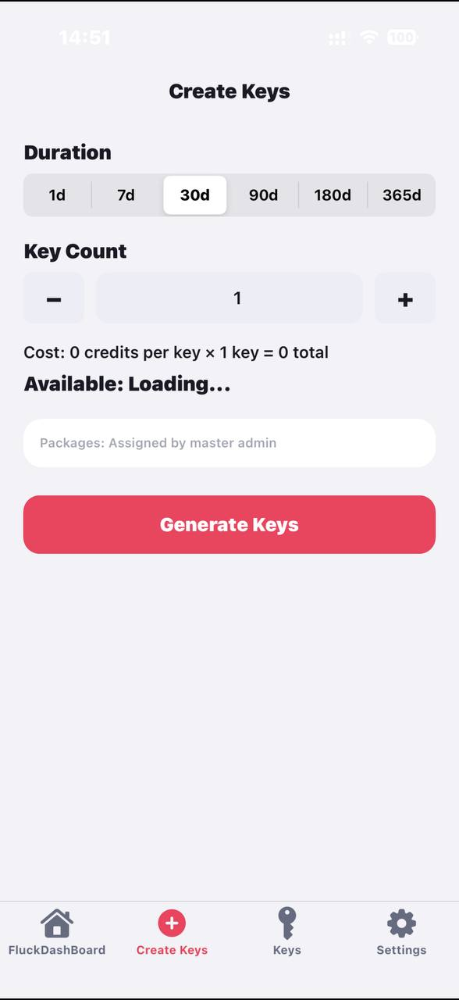
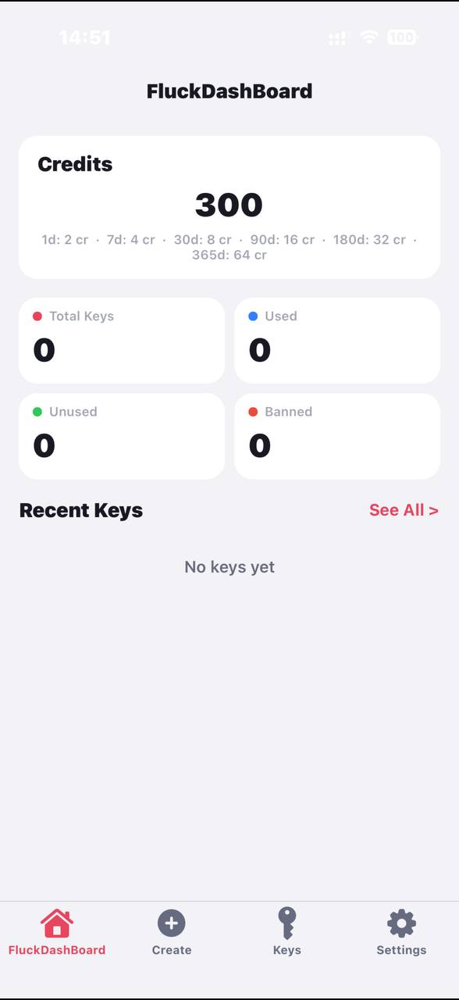

# KeyAuth iOS SDK

License validation and anti-tamper SDK for iOS apps. No source code—binary only.

---

## Files Included

| File | Purpose |
|------|---------|
| `libKeyAuth.a` | Static library (arm64) |
| `KeyAuth.h` | Public API header |
| `KeyAuthConfig.h` | Config declarations (define values in your app) |
| `themeAPI.mm` | Optional theme provider for KeyAuth UI |

---

## Requirements

- iOS 12+
- Xcode 12+
- **CoreTelephony** framework

---

## Quick Start

### 1. Add files to your project

- Add `libKeyAuth.a` and `KeyAuth.h` to your Xcode project
- Add `KeyAuthConfig.h` or copy the config declarations into your code

### 2. Link the library

In **Build Phases** → **Link Binary With Libraries**:

- Add `libKeyAuth.a`
- Add `CoreTelephony.framework`

### 3. Force-load the library

In **Other Linker Flags**, add:

```
-force_load $(SRCROOT)/path/to/libKeyAuth.a
```

Replace `path/to/` with the actual path to the library in your project.

### 4. Define config

In any `.m` file (e.g. `AppDelegate.m` or `Draw.mm`), **before** calling KeyAuth:

```objc
#import "KeyAuthConfig.h"
#import "KeyAuth.h"

// Your package values (from Fluck dashboard)
NSString * const KEYAUTH_APP_DISPLAY_NAME = @"Your App Name";

const uint8_t KEYAUTH_ENC_VERSION[] = {0x42, 0x56, 0x41, 0x56, 0x42};  // "1.0.1"
const NSUInteger KEYAUTH_ENC_VERSION_LEN = sizeof(KEYAUTH_ENC_VERSION);

const uint8_t KEYAUTH_ENC_APP_ID[] = {0x03, 0x0F, 0x0D, 0x56, ...};  // "com.your.appid"
const NSUInteger KEYAUTH_ENC_APP_ID_LEN = sizeof(KEYAUTH_ENC_APP_ID);

const uint32_t KEYAUTH_MAX_DYLIBS = 10;  // Max extra dylibs (anti-inject)
```

You must get the correct byte arrays for `KEYAUTH_ENC_VERSION` and `KEYAUTH_ENC_APP_ID` from your package config. Contact your provider for these values.

### 5. Start KeyAuth

Call before any KeyAuth-dependent logic:

```objc
- (void)viewDidLoad {
    [super viewDidLoad];
    [[KeyAuthSystem shared] start];
    // ... rest of your code
}
```

---

## Theme API (themeAPI.mm)

`themeAPI.mm` is an optional Objective‑C category that provides theme colors to KeyAuth’s built‑in UI. If your project has no menu/theme system (e.g. no `ModMenuViewController`), include `themeAPI.mm` so KeyAuth gets valid colors and does not crash.

### When to use

- **Use it** when KeyAuth shows UI (login, validation) and your app does not already supply theme methods on `KeyAuthSystem`.
- **Skip it** when your main menu (e.g. `Draw.mm` with `ModMenuViewController`) already implements the theme methods KeyAuth expects.

### Add to build

Include `themeAPI.mm` in your target’s compile sources (Xcode) or in `Makefile`:

```
$(TWEAK_NAME)_FILES = ... API/themeAPI.mm ...
```

### Theme keys (NSUserDefaults)

| Key | Type | Values | Default |
|-----|------|--------|---------|
| `ModMenuDarkMode` | `BOOL` | `YES` = dark, `NO` = light | `YES` |
| `ModMenuColorTheme` | `NSInteger` | `0` Red, `1` Blue, `2` Green, `3` Pink | `0` |
| `ModMenuWinterTheme` | `BOOL` | `YES` = winter style | `NO` |
| `ModMenuLiquidTheme` | `BOOL` | `YES` = liquid glass style | `NO` |

### Methods provided

| Method | Purpose |
|--------|---------|
| `isDarkMode` | Dark vs light mode |
| `isWinterTheme` | Winter theme active |
| `isLiquidTheme` | Liquid/glass theme active |
| `accentColor` | Main accent (buttons, highlights) |
| `backgroundColor` | Panel background |
| `textColor` | Primary text |
| `secondaryTextColor` | Secondary/muted text |
| `pillColor` | Pill/button background |
| `checkboxOffColor` | Unchecked checkbox |
| `glowColor` | Glow/shadow color |
| `borderColor` | Panel border |
| `separatorColor` | Divider lines |
| `pillBorderColor` | Pill border |

### Enabling Winter or Liquid theme

Set the keys **before** KeyAuth shows UI:

```objc
[[NSUserDefaults standardUserDefaults] setBool:YES forKey:@"ModMenuWinterTheme"];
[[NSUserDefaults standardUserDefaults] setBool:YES forKey:@"ModMenuLiquidTheme"];
[[NSUserDefaults standardUserDefaults] synchronize];
```

- **Winter:** Ice‑blue accent, cool backgrounds.
- **Liquid/Glass:** Semi‑transparent backgrounds and pills for a frosted look.

---

## API

```objc
[[KeyAuthSystem shared] start];                           // Initialize

[obj getPackageVersion];                                 
[obj getAppID];                                           // e.g. "com.dts.samwill"
[obj getAppDisplayName];                                  // Display name
[obj getKey];                                             // License key (if set)

[obj validatePackageWithCompletion:^(BOOL valid, NSString *err, NSDictionary *data) {
    if (!valid) { /* show err, exit */ }
}];
```

---

## Troubleshooting

| Issue | Fix |
|-------|-----|
| Undefined symbols | Ensure `-force_load` is set for `libKeyAuth.a` |
| Compile errors | Add `CoreTelephony` framework |
| Validation fails | Check app ID, version, and encoded bytes match your package |
| Injection detected | Increase `KEYAUTH_MAX_DYLIBS` if using legitimate dylibs |
| KeyAuth UI crash / bad colors | Add `themeAPI.mm` to the build and ensure theme keys are set before KeyAuth runs |

---

## MYDash

**MYDash.ipa** — dashboard for devs. Create bans, manage keys, and full control over your packages.

| Loading | Login |
|:-------:|:-----:|
|  |  |

| Key Creation | Home |
|:-------------:|:----:|
|  |  |

---

## Contact

- **Discord:** @zexisyy_
- **Telegram:** @zexisyy

---

## Credits

See [CREDITS.md](CREDITS.md).

---

## License

Proprietary. Use only as permitted by the provider.
